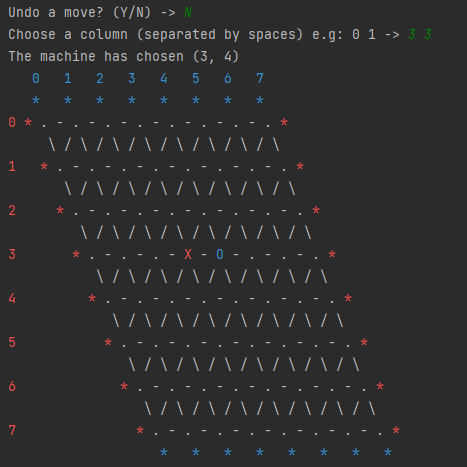
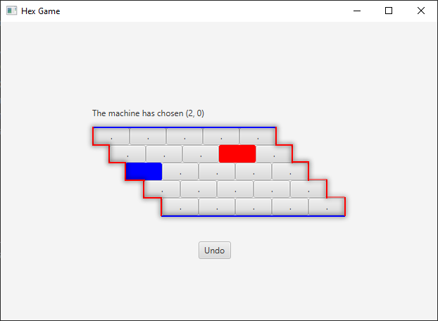

### I've tried to make this the game as immutable, recursive and pure as possible

---
# TUI
- ##### Run the Main.scala in order to play with the TUI, you can choose the board's size and a color for the player
- Since we need to display the board content in the TUI, its not possible to make it 100% pure, all it can be done is try to separate the impure functions from the pure functions, all the impure functions are located in the Display and UserInput objects

---

# GUI
- The GUI is a static 5x5 version of the Hex game, since is not as flexible as the TUI you can only choose your color (blue or red) 
- #### Run the object FxApp inside the HexGameGUI in order to play with the GUI

#### I had to find a way to memorize some important values in order to build the GUI, therefore some variables which were previously immutable are now mutable
> - private var currentBoard ... 
> > - variable to memorize the currentboard
> 
> - private var boardStates ...
> > - variable to memorize all the board states throughout the game, its useful for the undo feature 
> 
> - private var humanPlayer ...
> > - variable to memorize the color the human chooses
> 
> - private var machinePlayer ...
> > - variable to memorize the machine's color
> 
> - private var myRandom ...
> > - variable to maintain the game randomness
> > 

#### The game state changes everytime a button is clicked

---

